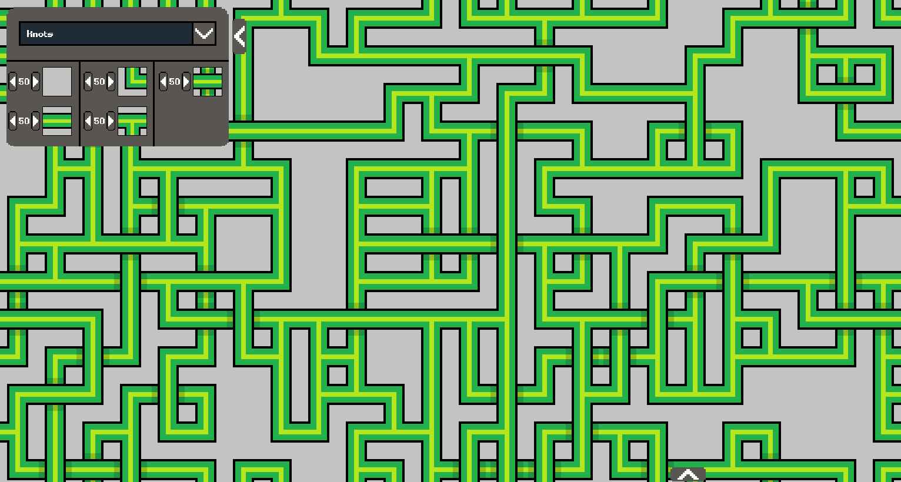
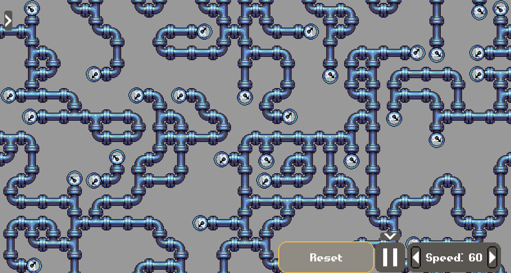

# Wave Function Collapse using C++ and raylib

This repo is my attempt at implementing a simple wave function collapse algorithm specifically for tilesets. It is inspired by the work of [Maxim Gumin](https://github.com/mxgmn/WaveFunctionCollapse).

The program includes hand made controls for changing the speed of the simulation, as well as swapping out the tilesets.

Currently the work requires [raylib](https://www.raylib.com/) to be preinstalled (with a working C++ compiler) to compile. There is a playable version (compiled using emscripten) on [Itch.io](https://atiladhun.itch.io/wavefunction-collapse)!

The C++ code is written using modern C++, and requires C++20 support to compile. 

The tilesets included in the `tilesets/` folder are from [Maxim Gumin](https://github.com/mxgmn/WaveFunctionCollapse/tree/master/tilesets/Circuit) and [Guy Walker's](http://www.cr31.co.uk/stagecast/wang/intro.html) websites, with minor tweaks when required (such as changing all tiles to be 32x32).

The `data.txt` files included with each texture are in a custom format. I may change it to json/xml/yaml in the future to improve readability.

## Examples:

## To do:
- Add CMake recipe
- Add more tilesets